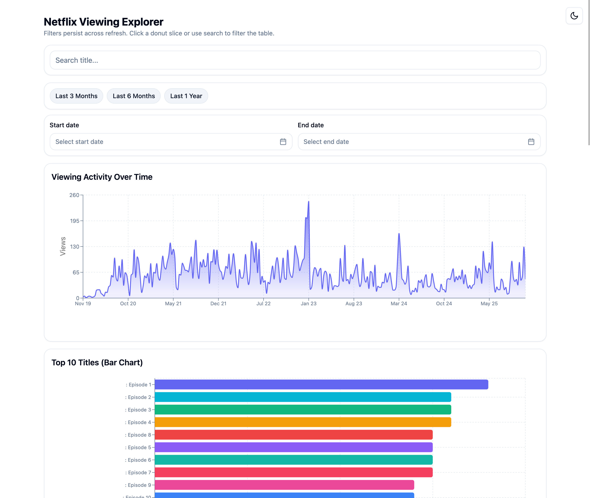
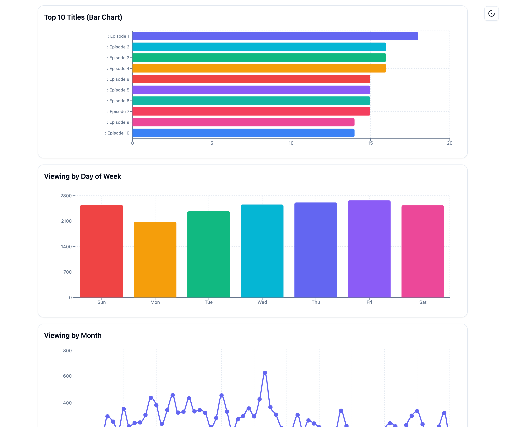
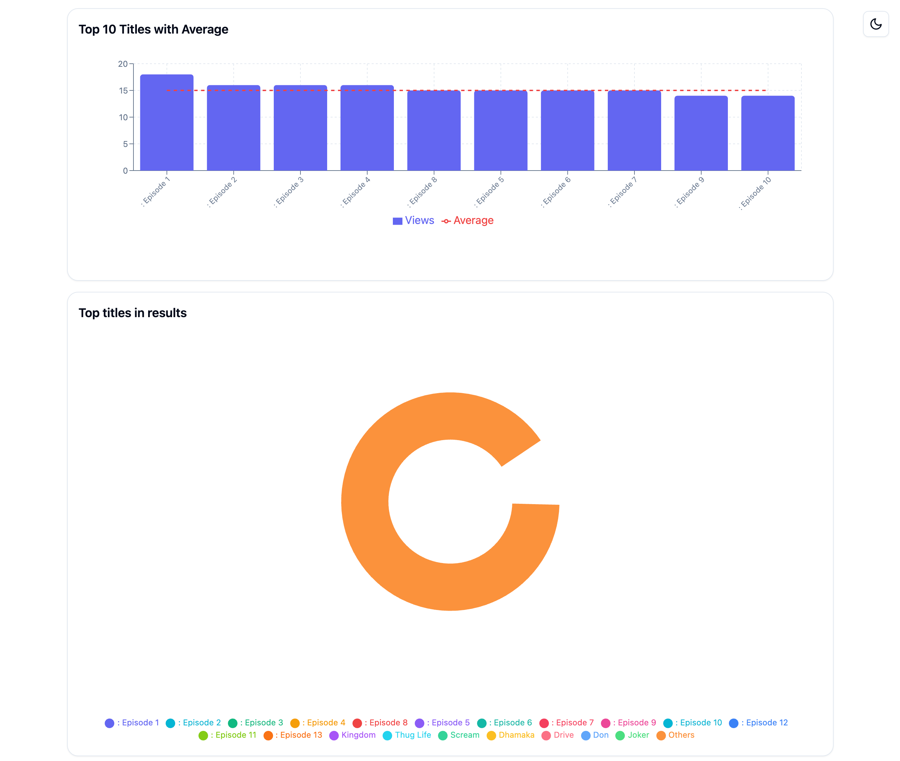
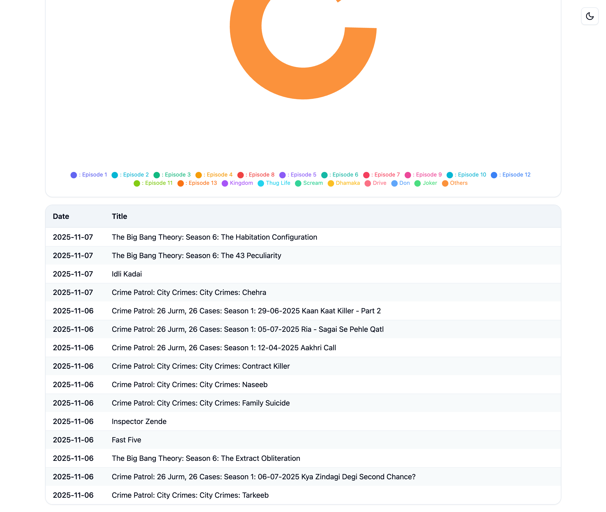
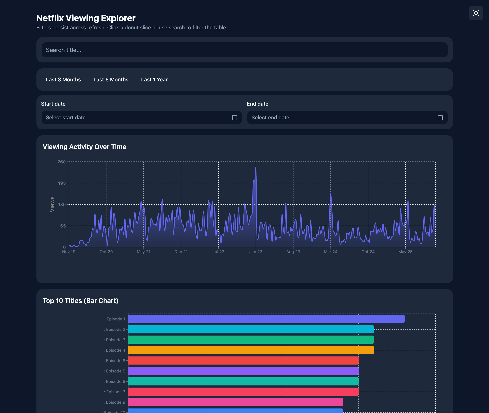
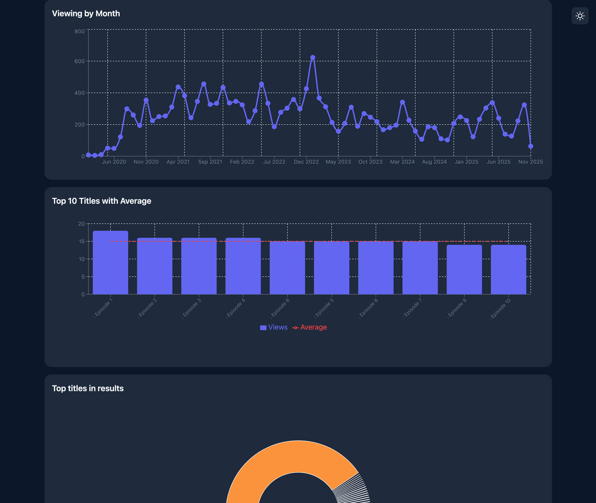
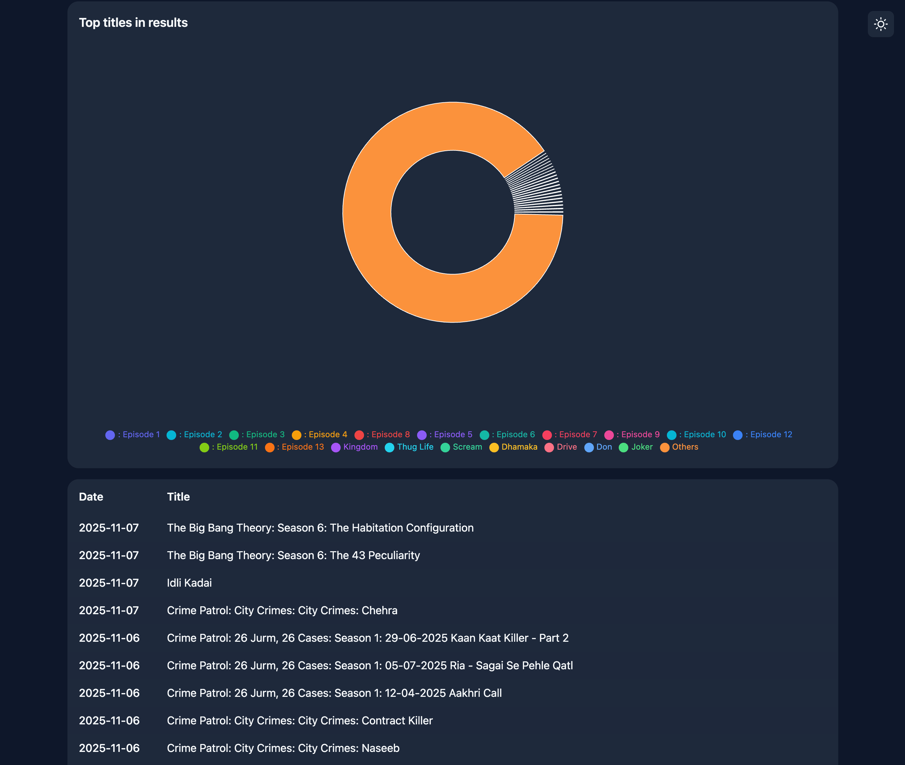
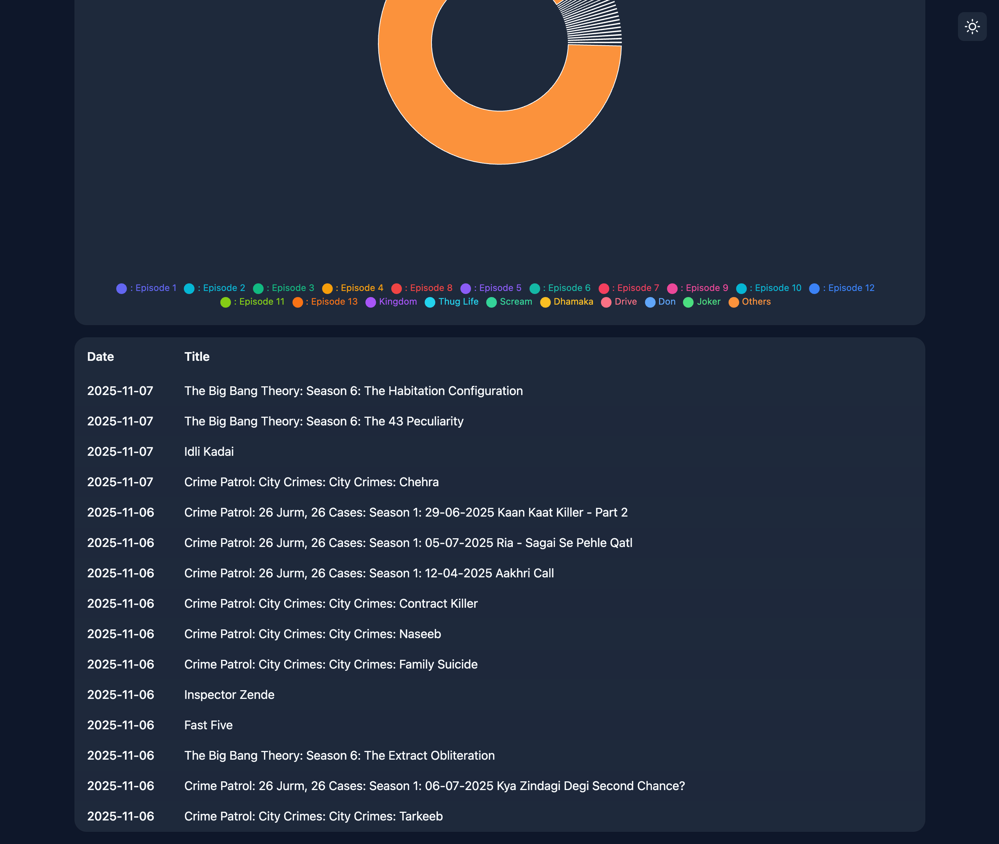

# Netflix Viewing Explorer

A comprehensive, interactive analytics dashboard for exploring Netflix viewing history. Built with React, Tailwind CSS, and Recharts, featuring advanced data visualization, filtering capabilities, and a modern dark/light theme system.



## 📸 Screenshots

### Light Theme

#### Main Dashboard


#### Charts and Visualizations


#### Data Table


### Dark Theme

#### Main Dashboard


#### Charts and Visualizations


#### Interactive Features


#### Data Table


#### Full View


## 🎯 Features

### Core Functionality
- **Interactive Search**: Real-time search filtering with debounced input (300ms delay)
- **Date Range Filters**: Custom date picker with quick filter presets (Last 3 Months, Last 6 Months, Last 1 Year)
- **Donut Chart Interaction**: Click on chart slices to filter the table by specific titles
- **Multiple Visualizations**:
  - Timeline chart showing viewing activity over time
  - Bar charts for top titles and day-of-week analysis
  - Line charts for monthly trends
  - Composed charts with average lines
  - Interactive donut chart with legend

### Advanced Features
- **Shimmer Loading Effects**: Beautiful loading animations while CSV data is being parsed
- **Dark/Light Theme**: Full theme system with persistent user preference
- **Virtualized Table**: High-performance table using TanStack Virtual for handling large datasets
- **State Persistence**: Filters persist across page refreshes via localStorage
- **URL Sharing**: All filter states are mirrored to URL parameters for easy sharing
- **Responsive Design**: Fully responsive layout that works on all screen sizes

## 🛠️ Tech Stack

### Core Technologies
- **React 18**: Modern React with hooks and functional components
- **Vite**: Fast build tool and development server
- **Tailwind CSS 3**: Utility-first CSS framework
- **Recharts**: Composable charting library built on React and D3

### Data & Parsing
- **PapaParse**: Fast CSV parsing library
- **date-fns**: Modern date utility library for date manipulation

### UI Components & Styling
- **shadcn/ui**: High-quality component library (table components)
- **TanStack Virtual**: Efficient virtualization for large lists
- **react-day-picker**: Accessible date picker component
- **class-variance-authority**: For component variants
- **clsx & tailwind-merge**: Utility functions for className management

### Development Tools
- **ESLint**: Code linting with standard configuration
- **PostCSS & Autoprefixer**: CSS processing

## 📦 Installation

### Prerequisites
- Node.js 18+ and npm (or yarn/pnpm)

### Setup

1. **Clone the repository** (or download the project):
   ```bash
   git clone <repository-url>
   cd netflix-analytics-ui
   ```

2. **Install dependencies**:
   ```bash
   npm install
   ```

3. **Add your data file**:
   - Place your `NetflixViewingHistory.csv` file in `public/data/`
   - The CSV should have columns: `Title` and `Date`
   - Date format: `M/D/YY` or `MM/DD/YY` (US-style dates)

4. **Start the development server**:
   ```bash
   npm run dev
   ```

5. **Open your browser**:
   - Navigate to the URL shown in the terminal (usually `http://localhost:5173`)

## 🚀 Deployment

### Netlify Deployment

The project is configured for easy deployment on Netlify:

1. **Automatic Configuration**:
   - `netlify.toml` is configured with:
     - Build command: `npm run build`
     - Publish directory: `dist`
     - Node version: 18

2. **Manual Deployment Steps**:
   ```bash
   # Build the project locally first to verify
   npm run build
   
   # The dist folder will be created with production files
   ```

3. **Netlify Settings** (if not using netlify.toml):
   - **Build command**: `npm run build`
   - **Publish directory**: `dist`
   - **Node version**: 18 (or use `.nvmrc` file)

4. **Environment Variables**:
   - No environment variables required for basic deployment
   - All data is loaded from `public/data/NetflixViewingHistory.csv`

5. **Troubleshooting Netlify Builds**:
   - Ensure `package.json` has the `build` script
   - Verify all dependencies are in `package.json` (not just devDependencies)
   - Check that `package-lock.json` is committed
   - Ensure Node version matches (18+)
   - Verify `netlify.toml` exists in the root directory

## 🚀 Usage

### Basic Operations

1. **Search**: Type in the search bar to filter titles in real-time
2. **Date Filtering**: 
   - Use quick filter buttons for common ranges
   - Or select custom start and end dates using the date pickers
3. **Chart Interaction**: Click on any slice in the donut chart to filter by that title
4. **Clear Filters**: Click the "Clear All" button to reset all filters
5. **Theme Toggle**: Click the sun/moon icon in the top-right to switch themes

### Data Visualization

- **Timeline Chart**: Shows viewing activity over time with automatic weekly grouping for large datasets
- **Top 10 Titles Bar Chart**: Horizontal bar chart showing most-watched titles
- **Day of Week Chart**: Bar chart showing viewing patterns by day
- **Monthly Chart**: Line chart showing trends over months
- **Composed Chart**: Combined bar and line chart with average calculation
- **Donut Chart**: Interactive pie chart showing top 20 titles with "Others" bucket

### State Persistence

All filter states are automatically saved:
- **localStorage**: Persists across browser sessions
- **URL Parameters**: Enables sharing filtered views via URL
- **Theme Preference**: Dark/light mode preference is saved

## 📁 Project Structure

```
netflix-analytics-ui/
├── public/
│   └── data/
│       └── NetflixViewingHistory.csv    # Your viewing history data
├── src/
│   ├── components/
│   │   ├── ui/                          # shadcn/ui components
│   │   │   └── table.jsx                # Table component primitives
│   │   ├── BarChart.jsx                 # Horizontal bar chart
│   │   ├── ComposedChart.jsx            # Bar + line chart
│   │   ├── DatePicker.jsx               # Date selection component
│   │   ├── DayOfWeekChart.jsx           # Day-of-week analysis
│   │   ├── Donut.jsx                    # Interactive donut chart
│   │   ├── Filters.jsx                  # Filter container
│   │   ├── MonthlyChart.jsx             # Monthly trends
│   │   ├── QuickFilters.jsx             # Quick date range buttons
│   │   ├── SearchBar.jsx                # Search input with debouncing
│   │   ├── Shimmer.jsx                  # Loading skeleton components
│   │   ├── Table.jsx                    # Virtualized data table
│   │   ├── ThemeToggle.jsx              # Dark/light theme switcher
│   │   └── Timeline.jsx                 # Time series chart
│   ├── hooks/
│   │   ├── usePersistentState.js        # localStorage + URL sync hook
│   │   └── useTheme.js                  # Theme management hook
│   ├── lib/
│   │   ├── date.js                      # Date parsing utilities
│   │   └── utils.js                     # Utility functions (cn helper)
│   ├── App.jsx                          # Main application component
│   ├── main.jsx                         # Application entry point
│   └── styles.css                       # Global styles + theme variables
├── index.html                           # HTML template
├── package.json                         # Dependencies and scripts
├── tailwind.config.js                   # Tailwind configuration
├── vite.config.js                       # Vite configuration
└── README.md                            # This file
```

## 🎨 Theme System

The application includes a comprehensive dark/light theme system:

### Theme Variables
- **Background**: Main page background color
- **Foreground**: Primary text color
- **Card**: Card background color
- **Border**: Border colors throughout
- **Muted**: Secondary backgrounds and text
- **Accent**: Interactive element colors
- **Primary/Secondary**: Button and emphasis colors

### Theme Implementation
- Uses CSS custom properties (CSS variables)
- Automatically detects system preference on first load
- Persists user choice in localStorage
- All components use theme-aware colors
- Smooth transitions between themes

### Customization
Edit `src/styles.css` to modify theme colors:
- Light theme: `:root` selector
- Dark theme: `.dark` selector

## ⚡ Performance Optimizations

### Virtualization
- **Table**: Uses TanStack Virtual to render only visible rows
- Handles thousands of rows efficiently
- Configurable overscan for smooth scrolling

### Memoization
- All computed data (filtered results, chart data) uses `useMemo`
- Prevents unnecessary recalculations on re-renders
- Optimized for large datasets

### Code Splitting
- Components are organized for potential code splitting
- Lazy loading can be easily added for charts

## 🔧 Development

### Available Scripts

```bash
# Start development server
npm run dev

# Build for production
npm run build

# Preview production build
npm run preview

# Run linter
npm run lint
```

### Code Style
- ESLint with standard configuration
- Functional components with hooks
- Prop validation via JSDoc (TypeScript recommended for future)
- Consistent naming conventions

### Adding New Features

1. **New Chart Component**:
   - Create component in `src/components/`
   - Use Recharts for visualization
   - Accept `data` and `isLoading` props
   - Add shimmer loading state

2. **New Filter**:
   - Add to `Filters.jsx` or create new component
   - Use `usePersistentState` hook for persistence
   - Update URL sync in `App.jsx`

3. **New Theme Colors**:
   - Add CSS variables in `src/styles.css`
   - Update Tailwind config if needed
   - Use in components via Tailwind classes

## 📊 Data Format

### CSV Structure
Your `NetflixViewingHistory.csv` should have:
- **Title**: Name of the show/movie
- **Date**: Viewing date in US format (`M/D/YY` or `MM/DD/YY`)

Example:
```csv
Title,Date
"Stranger Things","11/15/19"
"The Crown","12/20/19"
```

### Date Parsing
- Automatically handles various US date formats
- Normalizes to `YYYY-MM-DD` for consistency
- Filters invalid dates automatically

## 🎯 Key Components

### App.jsx
Main application component that:
- Loads and parses CSV data
- Manages all filter states
- Computes derived data for charts
- Handles URL/localStorage synchronization
- Initializes theme system

### Table.jsx
High-performance virtualized table:
- Uses TanStack Virtual for rendering
- Handles large datasets efficiently
- Sticky header for easy reference
- Row highlighting on hover
- Responsive column widths

### Donut.jsx
Interactive donut chart:
- Shows top 20 titles + "Others" bucket
- Click slices to filter table
- Shows percentages in tooltips
- Color-coded legend
- Active state highlighting

### ThemeToggle.jsx
Theme switcher component:
- Fixed position in top-right
- Sun/moon icons
- Smooth transitions
- Persists preference

## 🔐 State Management

### Persistence Strategy
1. **localStorage**: Primary storage for filter states
2. **URL Parameters**: Secondary storage for sharing
3. **Hydration Order**:
   - On load: Check URL first, then localStorage
   - On change: Update both localStorage and URL

### State Flow
```
User Action → Component State → usePersistentState → localStorage + URL
                                                      ↓
                                              App State Update
                                                      ↓
                                              Memoized Computations
                                                      ↓
                                              Component Re-render
```

## 🐛 Troubleshooting

### Common Issues

1. **Data not loading**:
   - Check CSV file is in `public/data/`
   - Verify CSV has `Title` and `Date` columns
   - Check browser console for errors

2. **Theme not applying**:
   - Clear browser cache
   - Check localStorage for theme value
   - Verify `dark` class is on `<html>` element

3. **Table not rendering**:
   - Check data format
   - Verify TanStack Virtual is installed
   - Check browser console

4. **Performance issues**:
   - Reduce dataset size for testing
   - Check virtualization is working
   - Verify memoization is in place

## 📝 Future Enhancements

Potential improvements:
- [ ] Export filtered data to CSV
- [ ] Additional chart types (heatmaps, scatter plots)
- [ ] Advanced filtering (genre, year, etc.)
- [ ] Data aggregation options
- [ ] Custom date range presets
- [ ] Chart export (PNG/PDF)
- [ ] Keyboard shortcuts
- [ ] Accessibility improvements (ARIA labels, keyboard navigation)
- [ ] Unit and integration tests
- [ ] TypeScript migration

## 🤝 Contributing

1. Fork the repository
2. Create a feature branch
3. Make your changes
4. Ensure code follows existing style
5. Test thoroughly
6. Submit a pull request

## 📄 License

This project is open source and available for educational purposes.

## 🙏 Acknowledgments

- Netflix for providing the data format
- Recharts team for excellent charting library
- shadcn for beautiful UI components
- TanStack for virtualization library

---

**Built with ❤️ using React, Tailwind CSS, and modern web technologies**
